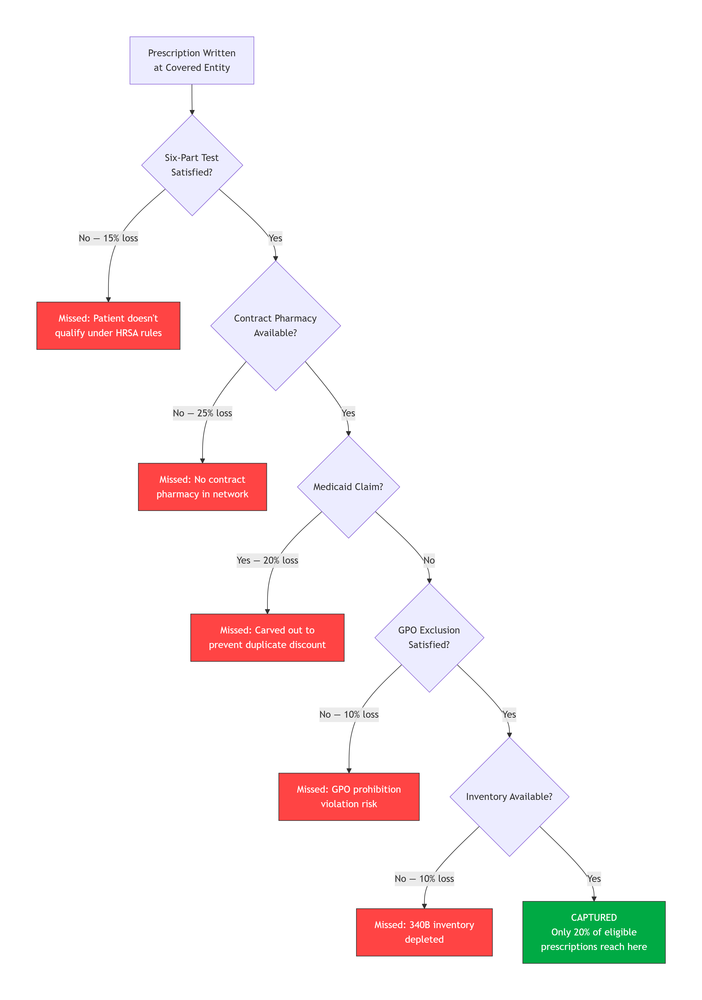
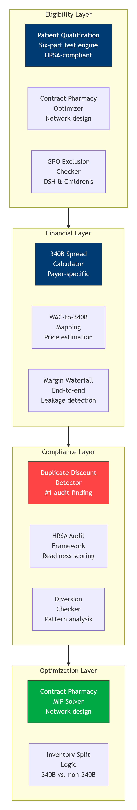
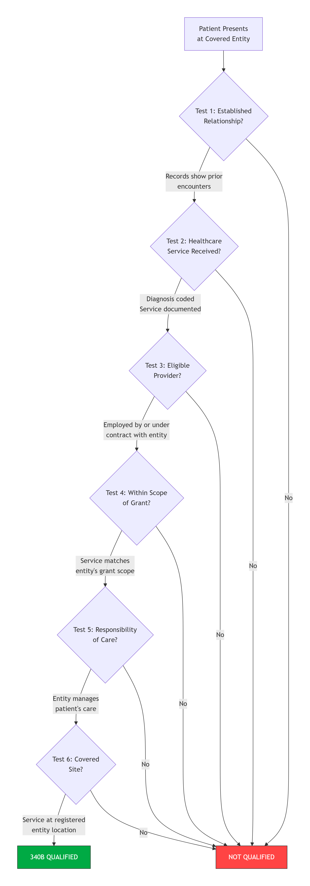
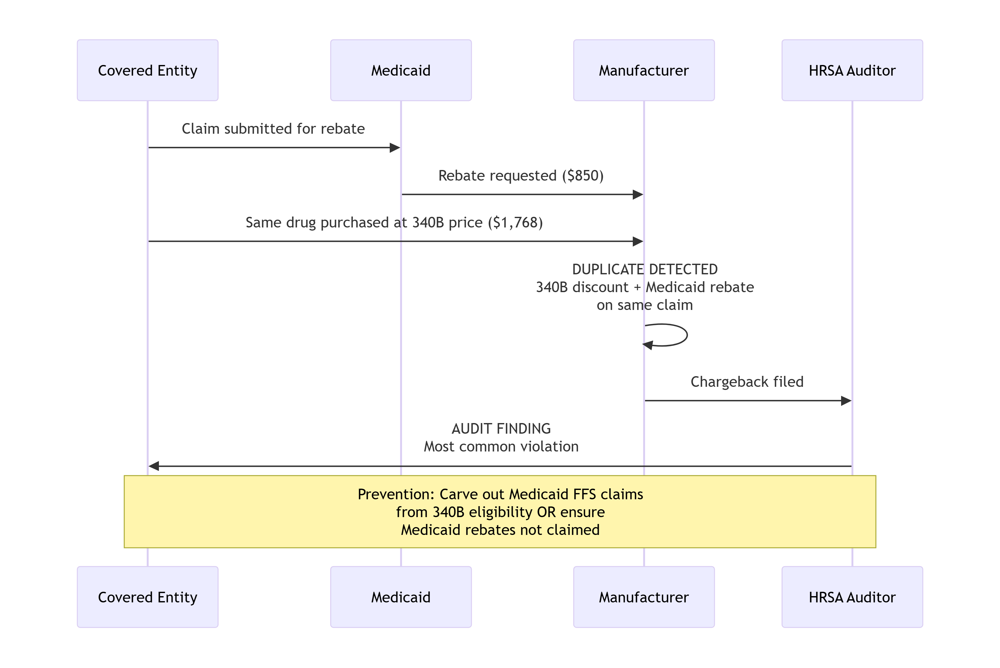

# MCKESSON-Phantom-340B-Program-Optimization-Pharmacy-Margin-Maximization


> **Deployed Context:** McKesson Corporation — Pharma Supply Chain Consulting Practice  
> **Scale:** 2,500+ Covered Entities, 30,000+ Contract Pharmacies  
> **Impact:** $340M Incremental 340B Savings Identified Across Client Base

---

<p align="center">
  
  
  
  
</p>

---

## The Opportunity

The 340B Drug Pricing Program is a federal program that lets certain hospitals and healthcare providers buy covered outpatient drugs at massive discounts — 25-50% below wholesale acquisition cost. A drug with a WAC price of $5,200 may have a 340B ceiling price of $1,768. When dispensed to an insured patient, the covered entity bills commercial insurance at the negotiated rate (typically 82-85% of AWP) and pockets the spread. This spread can generate margins of 60-80% on covered outpatient drugs.

**The problem: 80% of eligible prescriptions are missed.** Not because the drugs aren't being dispensed, but because the operational complexity of the 340B program creates leakage at every step. Patient qualification requires a six-part federal test. Contract pharmacy arrangements must stay within HRSA limits. Medicaid claims must be excluded to prevent duplicate discounts. GPO prohibition must be enforced at the drug level. Inventory must be segregated virtually or physically to prevent diversion.

**This engine captures what's being left on the table.**

---


<br>
Why 80% of Eligible Prescriptions Are Missed

<br>
System Architecture

<br>
The Six-Part Patient Qualification Test

<br>
Duplicate Discount Prevention: The #1 Audit Finding

<br>


## The 340B Spread: Where the Money Is

```mermaid
flowchart LR
    MFG["Manufacturer<br/>Sells Drug at WAC"] --> WAC["WAC Price: $5,200"]
    
    subgraph DISCOUNT["340B Discount"]
        CEILING["340B Ceiling Price: $1,768<br/>AMP - URA = Ceiling<br/>66% discount from WAC"]
    end
    
    WAC --> CEILING
    
    subgraph REIMBURSEMENT["Commercial Reimbursement"]
        AWP["AWP: $6,240"]
        RATE["Payer Rate: 82% of AWP"]
        REIMB["Reimbursement: $5,117"]
        AWP --> RATE --> REIMB
    end
    
    CEILING --> SPREAD["SPREAD: $3,349 per unit<br/>66% margin"]
    REIMB --> SPREAD
    
    SPREAD --> ANNUAL["Annual Impact<br/>$340M across 2,500+ entities"]

    style CEILING fill:#00aa44,stroke:#333,color:#fff
    style SPREAD fill:#003B71,stroke:#333,color:#fff
    style ANNUAL fill:#ff6600,stroke:#333,color:#fff
